# Quiblah Muslim (Quiblah-Muslim-)

A modern, comprehensive Islamic Progressive Web Application (PWA) engineered to provide precise prayer timings, Holy Quran reading and tafseer, continuous audio recitation streaming, an accurate Qibla compass, interactive nearby mosque mapping, daily adhkar counters, and background Web Push notifications.

Built purely with Vanilla JavaScript, modular CSS, and semantic HTML5, designed for high performance, smooth mobile interactivity, and complete offline capability.

---

## Table of Contents

- Overview
- Core Features and Mobile Screenshots
  - 1. Prayer Times and Islamic Dashboard
  - 2. Holy Quran Reader
  - 3. Quran Tafseer and Commentary
  - 4. Quran Audio Streaming Player
  - 5. Daily Azkar and Supplications
  - 6. Morning and Evening Adhkar (Sabah and Masaa)
  - 7. 99 Names of Allah (Asmaul Husna)
  - 8. Qibla Direction Compass
  - 9. Nearby Mosques Finder
  - 10. Geodesic Distance to Kaaba
- Modular Architecture
- Cross-Platform Installation Guide (Desktop, Android, iOS)
- Technical Stack
- Local Development Setup
- Progressive Web App (PWA) Offline Operation
- Contributing
- License and Author

---

## Overview

Quiblah Muslim is an open-source Islamic web application designed to serve as an indispensable daily companion for Muslims around the world. The application runs entirely client-side with minimal server dependencies, guaranteeing swift load speeds, robust offline usability, and broad cross-platform compatibility across iOS, Android, macOS, and Windows.

---

## Core Features and Mobile Screenshots

### 1. Prayer Times and Islamic Dashboard

Displays exact daily prayer times (Fajr, Sunrise, Dhuhr, Asr, Maghrib, Isha) tailored to the user's geographic coordinates, alongside a dynamic countdown timer for the upcoming prayer and dual Gregorian and Hijri calendar conversions.

| Prayer Times Overview | Countdown and Timings Schedule |
| :---: | :---: |
| 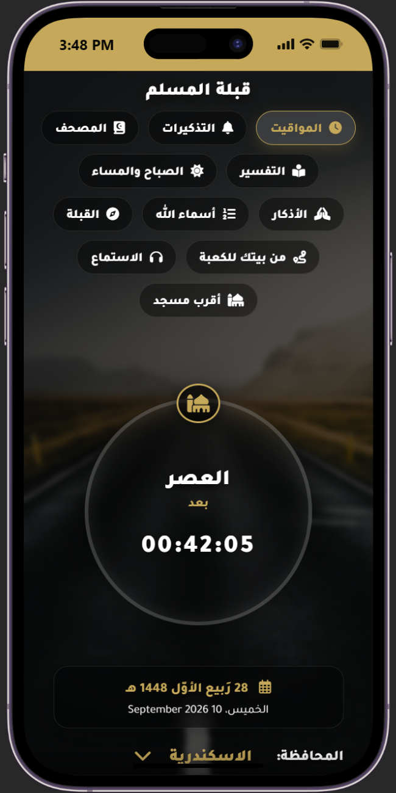 | 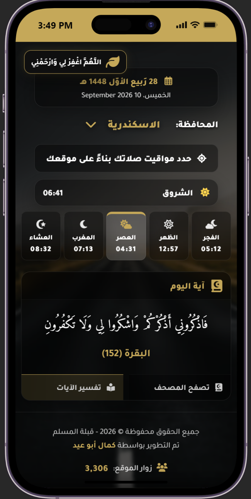 |

- **How It Works**:
  - Automatically requests user geolocation permissions via `navigator.geolocation`.
  - Queries the Aladhan API to obtain calculation parameters based on standard international authorities.
  - Updates remaining seconds every second through an asynchronous timer in `features/home/home.js`.
  - Features dynamic background transitions matching the atmospheric mood of the current time.

---

### 2. Holy Quran Reader

A full-fledged Quran reading experience featuring all 114 Surahs rendered in authentic Madani Arabic typography, an interactive surah selection drawer, search filters, and instant verse-level tafseer lookup.

| Surahs Drawer (Search & Index) | Surah Header & Audio Controls | Verse Reading Flow | Quick Verse Tafseer Modal |
| :---: | :---: | :---: | :---: |
| 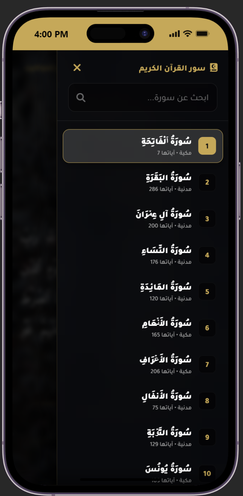 | 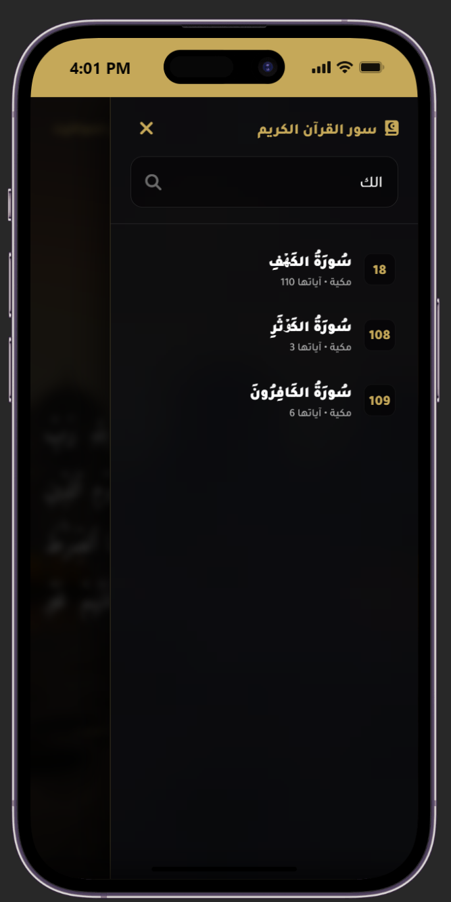 | 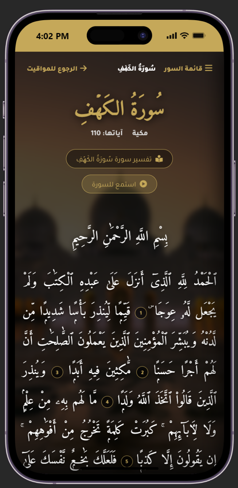 | 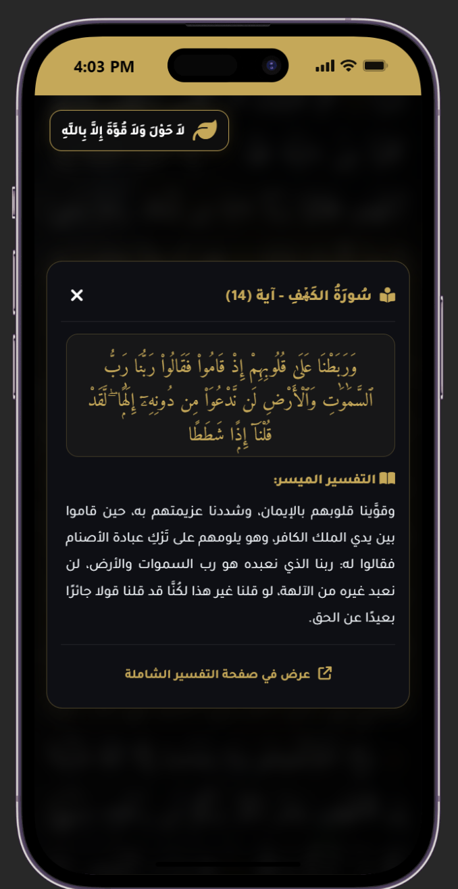 |

- **How It Works**:
  - Preloaded locally from `core/quran_data.js` and `core/surahs_meta.js` for instant, zero-latency offline reading.
  - Features side-by-side action buttons on mobile for reading tafseer and playing audio recitation simultaneously.
  - Clicking any verse number opens a transparent frosted-glass modal with verse-level explanation without interrupting the reading experience.

---

### 3. Quran Tafseer and Commentary

An extensive study module offering verse-by-verse commentary from reputable sources (Al-Tafseer Al-Muyassar and Tafseer Al-Jalalayn), coupled with ayah recitation playback, copying, and sharing capabilities.

| Tafseer Surah Overview | Verse Commentary Cards | Tafseer Search & Jump |
| :---: | :---: | :---: |
| 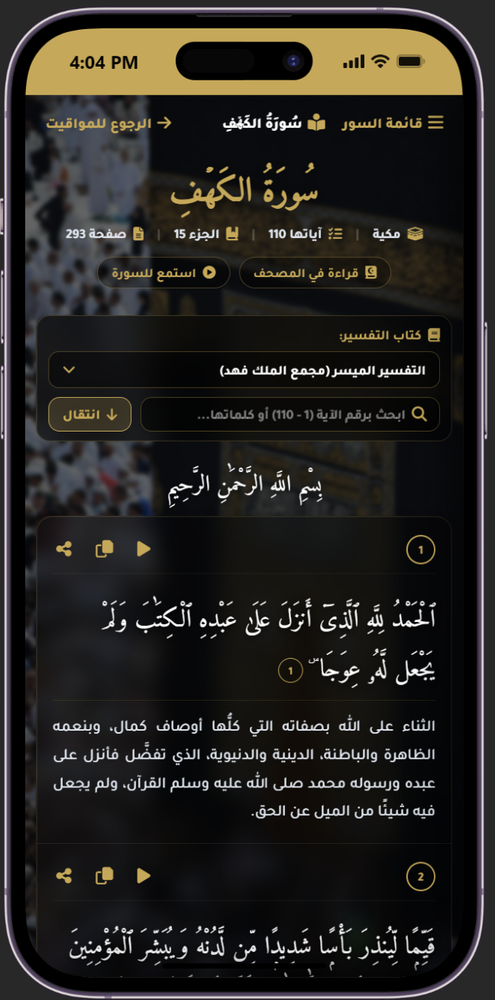 | 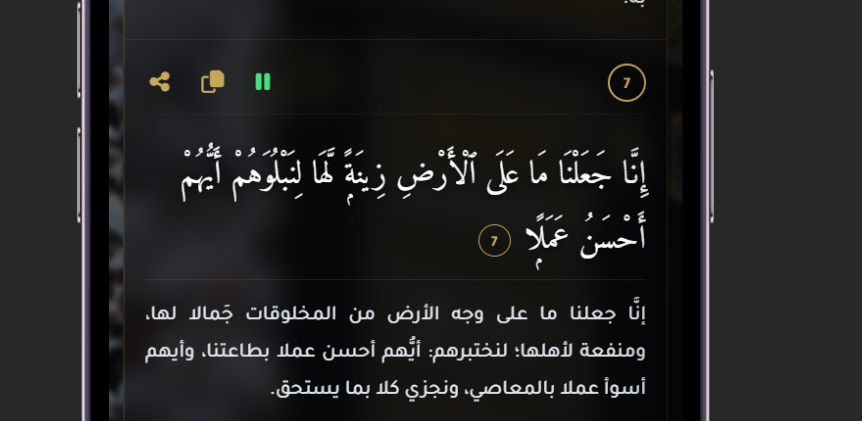 | 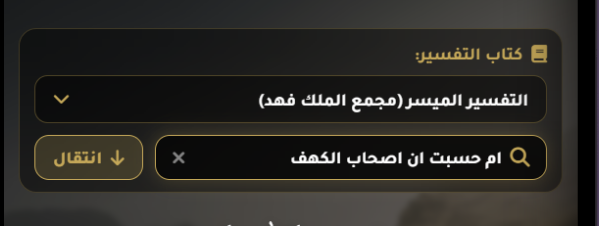 |

- **How It Works**:
  - Dynamically fetches commentary through asynchronous APIs with batched rendering for high performance.
  - Features individual verse audio playback and instant copy/share functionality.
  - Employs a transparent frosted glass sidebar drawer for fast surah switching on mobile devices.

---

### 4. Quran Audio Streaming Player

A modern continuous audio player inspired by international streaming platforms that continues playing recitations smoothly across page navigations without interruption.

| Curated Reciters Catalog | Surahs Recitation List | Compact Player Bar | Expanded Fullscreen Player |
| :---: | :---: | :---: | :---: |
| 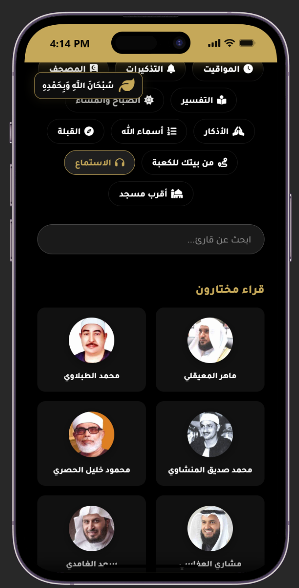 | 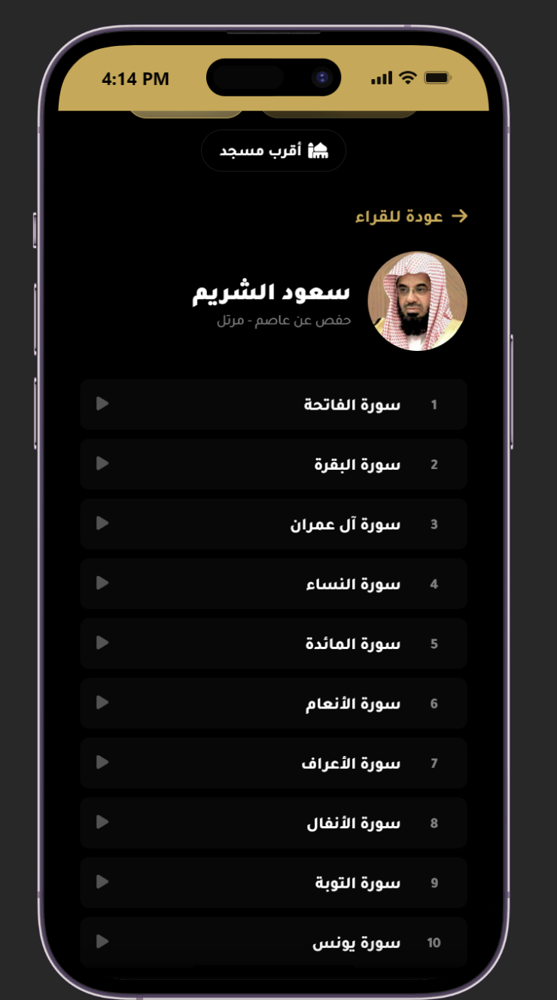 | 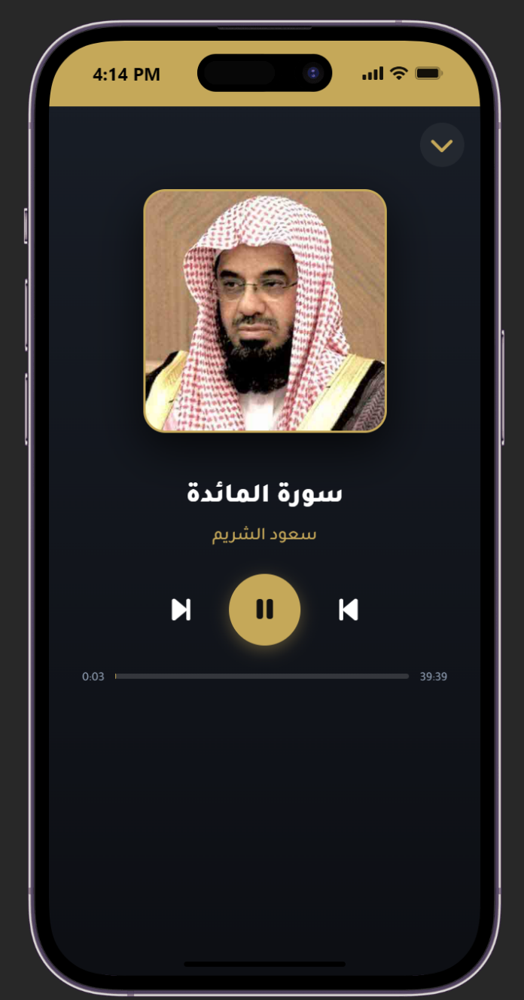 | 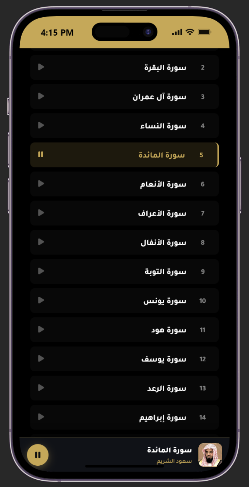 |

- **How It Works**:
  - Integrates with the MP3Quran API v3 covering prominent reciters (e.g., Mishary Rashid Alafasy, Abdul Basit, Yasser Al-Dosari, Mahmoud Khalil Al-Husary).
  - Uses `core/player-bridge.js` to communicate with the root frame, ensuring non-stop playback while browsing other sections.
  - Supports track scrubbing, seeking, volume controls, and mobile fullscreen expansion.
  - Renders over an animated background image carousel with translucent glassmorphic cards.

---

### 5. Daily Azkar and Supplications

A rich library of daily Islamic supplications with interactive repetition counters and sensory feedback.

| Supplication Categories | Interactive Azkar Counter | Completed Zikr State |
| :---: | :---: | :---: |
| 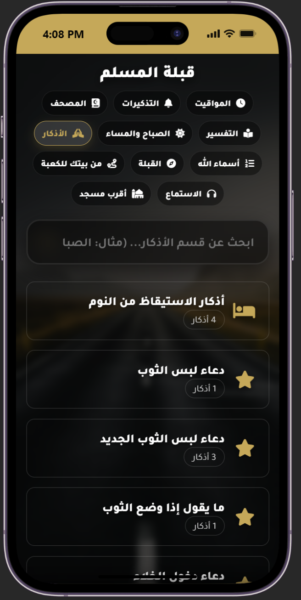 | 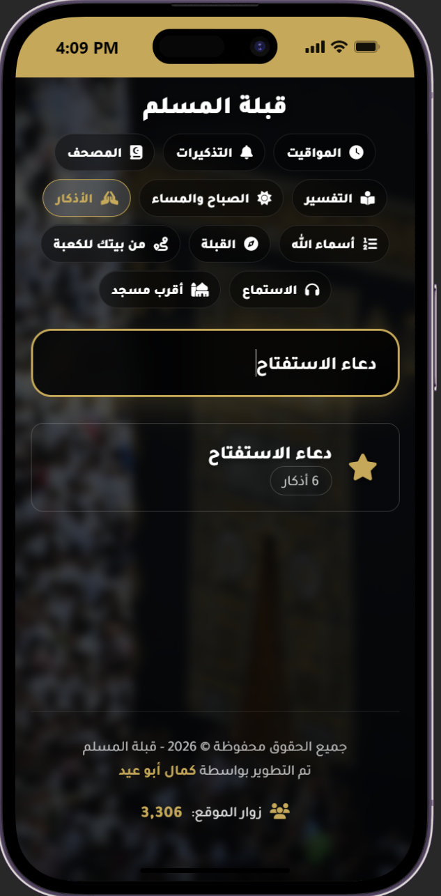 | 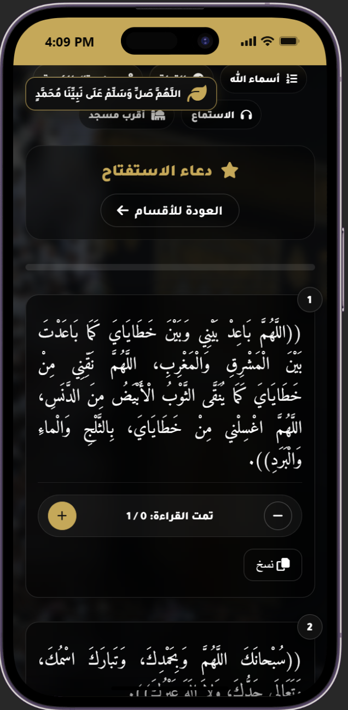 |

- **How It Works**:
  - Sourced from structured local datasets (`data/azkar.json` and `data/short_azkar.json`).
  - Interactive touch counters update repetition counts with vibration pulses via `navigator.vibrate`.
  - Automatically saves completion states in browser LocalStorage.

---

### 6. Morning and Evening Adhkar (Sabah and Masaa)

Dedicated section for Morning and Evening remembrance prayers with a twin-button category selector and electronic digital tasbeeh.

| Morning & Evening Selection | Adhkar Reading & Counter | Completed Session Feedback |
| :---: | :---: | :---: |
| 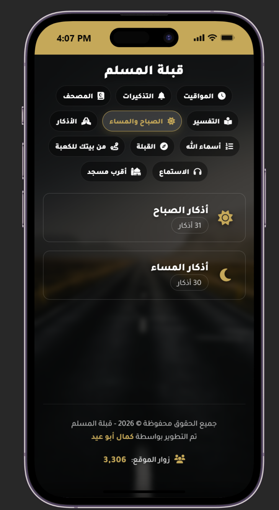 | 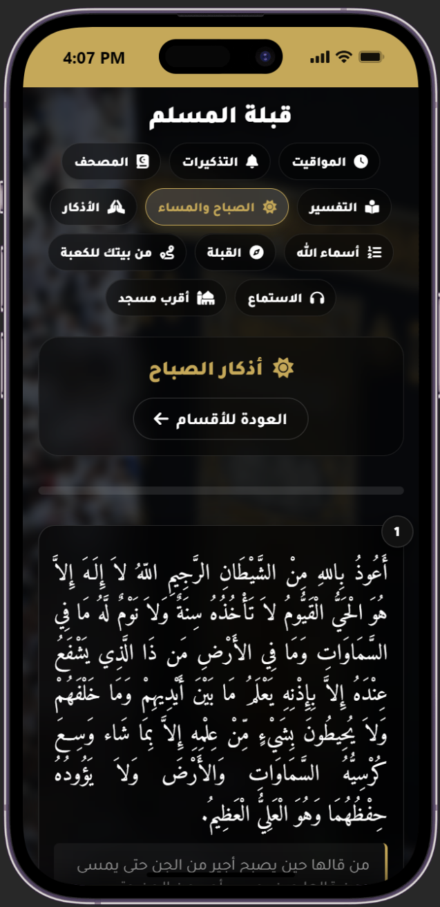 | 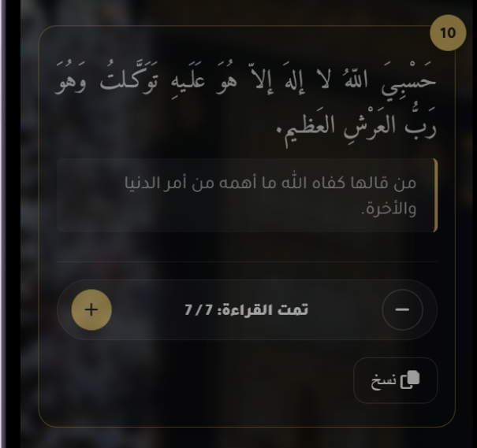 |

- **How It Works**:
  - Automatically suggests morning or evening prayers depending on the current time of day.
  - Displays virtues, Hadith references, and repetition counts for each supplication.

---

### 7. 99 Names of Allah (Asmaul Husna)

A complete visual catalog of the 99 Beautiful Names of Allah with Arabic calligraphy, transliteration, English translation, and theological meanings.

<p align="center">
  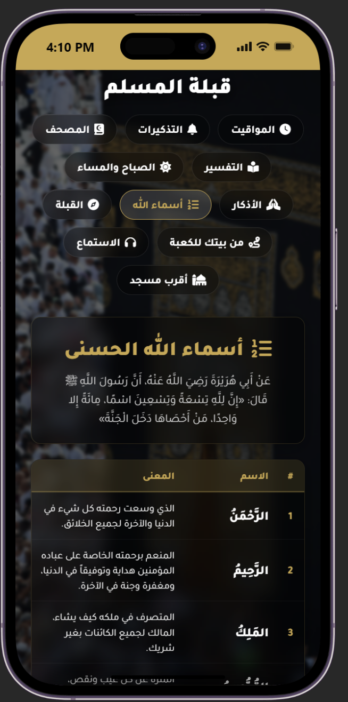
</p>

- **How It Works**:
  - Rendered dynamically from `data/names.json`.
  - Supports real-time client-side search filtering by name, number, or virtue.
  - Smooth card flip and accordion animations for reading comprehensive descriptions.

---

### 8. Qibla Direction Compass

A precision digital compass calculating and visualizing the exact bearing to the Holy Kaaba in Mecca from any location worldwide.

| Compass Sensor Alignment | Calibrated Qibla Azimuth |
| :---: | :---: |
| 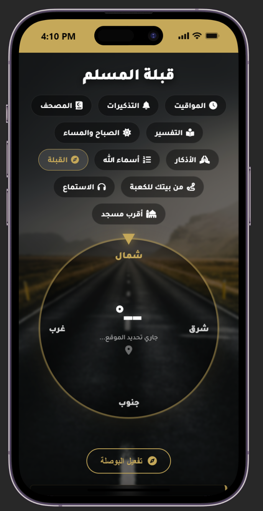 | 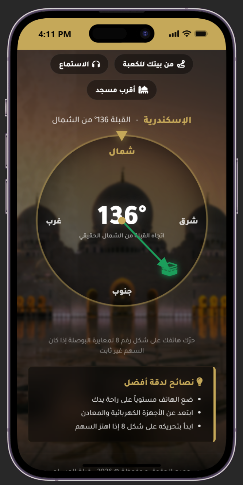 |

- **How It Works**:
  - Leverages `DeviceOrientationEvent` (`webkitCompassHeading` for iOS and absolute orientation angles for Android).
  - Calculates the forward azimuth to Mecca (21.4225° N, 39.8262° E) using great-circle spherical trigonometry.
  - Renders a hardware-accelerated compass rose and needle that smoothly tracks device movement.

---

### 9. Nearby Mosques Finder

An interactive geospatial mapping tool finding mosques within customizable search perimeters (1 km, 2 km, 3 km, and 5 km) around the user.

| Interactive Map Overview | Walking Distance Guidelines | Distance Guidelines Arc | Mosque Details Bottom Card | Direct Route Telemetry |
| :---: | :---: | :---: | :---: | :---: |
| 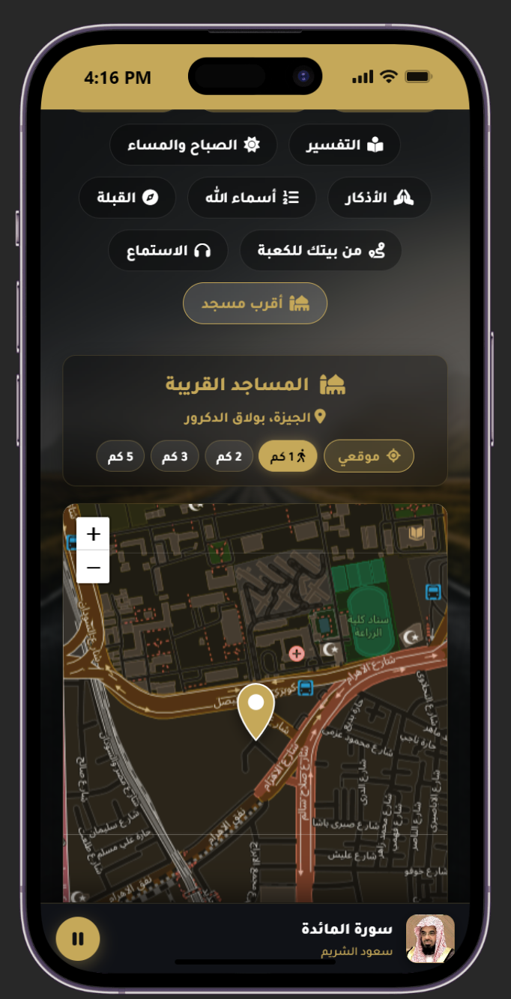 | 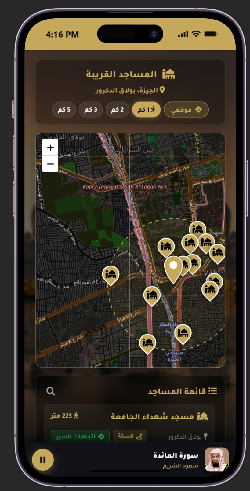 | 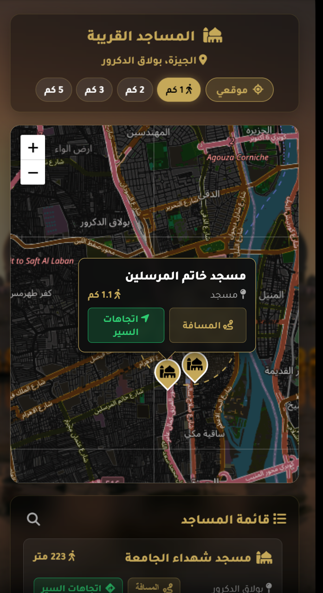 | 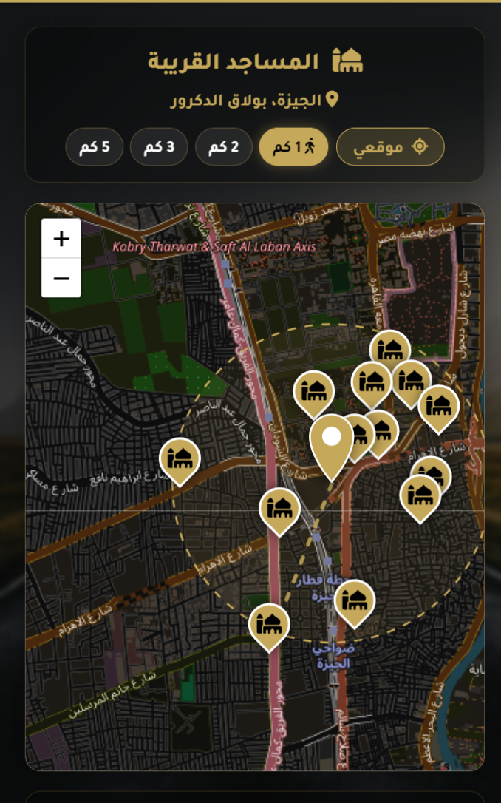 | 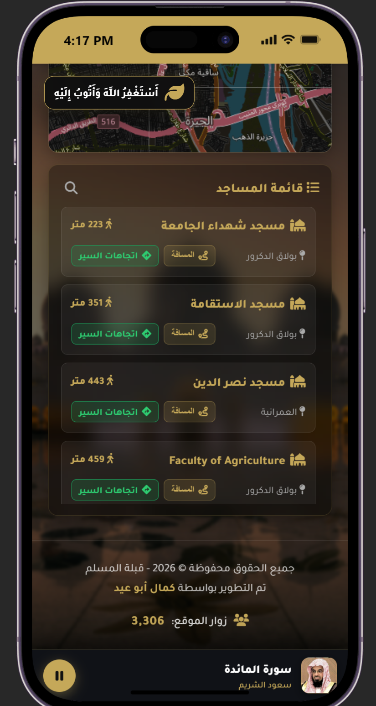 |

- **How It Works**:
  - Powered by Leaflet.js and OpenStreetMap cartography.
  - Queries the OpenStreetMap Overpass API for places of worship tagged with `amenity=place_of_worship` and `religion=muslim`.
  - Calculates straight-line walking distances and dynamically draws visual navigation guide paths.

---

### 10. Geodesic Distance to Kaaba

An interactive cartographic feature measuring the exact distance in kilometers from the user's home location to the Holy Kaaba in Mecca.

| Flight Route to Mecca | Geodesic Line and Measurements |
| :---: | :---: |
| 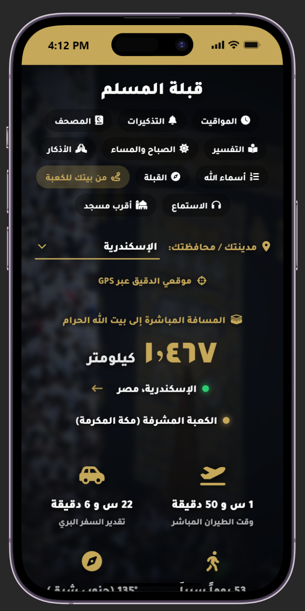 | 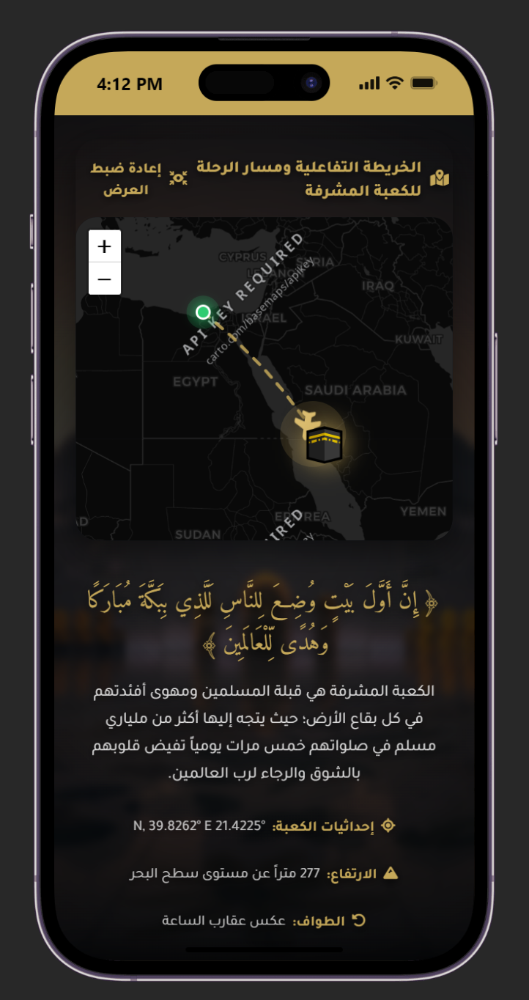 |

- **How It Works**:
  - Utilizes the Haversine formula to compute great-circle distance over the Earth's ellipsoidal surface.
  - Draws a geodesic curved polyline across the world map directly connecting the user to Mecca.

---

## Modular Architecture

The repository is structured with a **Feature-Based Modular Architecture**. Every domain feature is strictly isolated into its own folder containing its respective JavaScript logic and CSS stylesheet:

```text
PrayerTimer/
├── core/                                # Shared foundational modules
│   ├── player-bridge.js                 # Cross-frame audio communication bridge
│   ├── pwa.js                           # PWA installation and lifecycle controller
│   ├── reminders.js                     # Encrypted Web Push subscription client
│   ├── toast.js                         # Global notification toast system
│   ├── visitor-counter.js               # Anonymous visitor analytics tracker
│   ├── surahs_meta.js                   # Quran chapter indices and metadata
│   └── quran_data.js                    # Complete Quran Arabic text dataset
│
├── features/                            # Encapsulated feature modules (Logic + Styles)
│   ├── landing/                         # Shell and carousel (landing.js, landing.css)
│   ├── home/                            # Prayer times dashboard (home.js, home.css)
│   ├── quran/                           # Quran reading interface (quran.js, quran.css)
│   ├── tafseer/                         # Quran commentary module (tafseer.js, tafseer.css)
│   ├── listen/                          # Audio streaming player (listen.js, listen.css)
│   ├── azkar/                           # Daily adhkar catalog (azkar.js, azkar.css)
│   ├── sabah-masaa/                     # Morning/evening azkar (sabah-masaa.js, sabah-masaa.css)
│   ├── names/                           # 99 Names of Allah (names.js, names.css)
│   ├── qibla/                           # Qibla compass module (qibla.js, qibla.css)
│   ├── mosques/                         # Nearby mosque finder (mosques.js, mosques.css)
│   ├── distance/                        # Kaaba distance calculator (distance.js, distance.css)
│   └── reminders/                       # Notification settings (reminders-page.js, reminders-page.css)
│
├── data/                                # Local datasets (JSON)
│   ├── azkar.json                       # Comprehensive supplications
│   ├── short_azkar.json                 # Quick prayer adhkar
│   ├── names.json                       # Asmaul Husna definitions
│   └── verses.json                      # Selected Quranic verses
│
├── assets/                              # Static visual and audio assets
│   ├── ShotsREADME/                     # Organized documentation screenshots by feature
│   ├── Azan/                            # Audio recordings for prayer calls
│   ├── bg1.jpg, bg2.jpg, bg3.jpg        # High-resolution background photography
│   └── mosque.svg, favicon.png          # Vector branding assets
│
├── icons/                               # PWA application icons
├── api/                                 # Vercel serverless push notification handlers
├── cmd/quiblah/                         # Go astronomical prayer & Qibla calculation CLI / API engine
├── go.mod                               # Go module definition
├── Dockerfile                           # Production multi-stage Alpine container
├── docker-compose.yml                   # Docker Compose container configuration
├── *.html                               # Semantic HTML entrypoints
├── service-worker.js                    # PWA Service Worker with offline caching (v12)
├── server.js                            # Local Node.js HTTP and Push server
├── .gitattributes                       # GitHub Linguist language detection overrides
└── README.md                            # Comprehensive project documentation
```

---

## Cross-Platform Installation Guide (Desktop, Android, iOS)

Quiblah Muslim is designed as a standalone Progressive Web Application (PWA). It can be installed directly onto any operating system and device without visiting an app store. Once installed, it launches in its own dedicated, borderless window with an independent app icon, custom splash screen, and full offline functionality.

### Compatibility Matrix

| Platform | Supported Environments | Installation Method | Standalone Window | Offline Storage |
|---|---|---|:---:|:---:|
| **Windows 10 / 11** | Google Chrome, Microsoft Edge, Brave | Browser Install Prompt / URL Bar Icon | Yes | Yes (Service Worker v12) |
| **macOS** | Google Chrome, Microsoft Edge, Safari | Browser Install Prompt / Add to Dock | Yes | Yes (Service Worker v12) |
| **Linux & ChromeOS** | Google Chrome, Chromium, Brave | Browser Install Prompt / URL Bar Icon | Yes | Yes (Service Worker v12) |
| **Android** | Google Chrome, Samsung Internet, Edge | Automatic Install Banner / Menu Option | Yes | Yes (Service Worker v12) |
| **iOS (iPhone & iPad)** | Apple Safari, Chrome | Safari Share Sheet -> Add to Home Screen | Yes | Yes (Service Worker v12) |

### Step-by-Step Installation Instructions

#### 1. Android Devices (Samsung, Google Pixel, Xiaomi, etc.)
- Open the application URL in **Google Chrome** or **Samsung Internet**.
- An **Install App** popup banner will appear automatically at the bottom of your screen. Tap **Install**.
- If the banner does not appear: tap the browser menu (three vertical dots in the upper-right corner) and select **Install app** or **Add to Home screen**.
- The Quiblah Muslim icon will be added to your home screen and app drawer, operating completely independently with full-screen view.

#### 2. Apple Devices (iPhone and iPad)
- Open the application URL in **Apple Safari**.
- Tap the **Share** button located at the bottom center of the screen (a square icon with an arrow pointing upwards).
- Scroll down the share sheet and tap **Add to Home Screen**.
- Tap **Add** in the top-right corner to confirm.
- Quiblah Muslim will now appear on your iOS home screen as a standalone application, launching with a clean native experience without any Safari browser toolbars.

#### 3. Desktop Computers (Windows, macOS, Linux, ChromeOS)
- Open the application in **Google Chrome**, **Microsoft Edge**, or any Chromium-compatible browser.
- Look at the right-hand side of your address bar (URL bar). You will see an **Install** icon (a computer monitor with an arrow, or an install badge).
- Click the install icon and confirm by clicking **Install**.
- Alternatively, open the browser settings menu (three dots in the top-right) and choose **Save and share** -> **Install Quiblah Muslim**.
- The application will immediately detach into an independent desktop window and place a launcher shortcut on your Desktop and Start Menu / Application Launcher.

---

## Technical Stack

- **Client-Side Core**: Vanilla JavaScript (Modern ECMAScript ES6+).
- **Styling**: Native CSS3 with CSS Custom Properties (Variables), Flexbox, and CSS Grid.
- **Backend & Ephemeris Engine**: Go (Golang 1.20+) and Node.js (v18+).
- **Containerization**: Docker, Docker Compose (Alpine runtime).
- **PWA Architecture**: Service Worker API, Cache Storage API, Web App Manifest.
- **Sensors and Telemetry**: DeviceOrientation API, Geolocation API, Vibration API.
- **Geographic Mapping**: Leaflet.js (v1.9.4), OpenStreetMap, Overpass API.
- **Network Layer**: Axios HTTP client.
- **Notifications**: W3C Push API, VAPID encryption with `web-push`.
- **Fonts and Icons**: FontAwesome 6, Google Fonts (Tajawal, Amiri Quran).

---

## Local Installation and Setup

### Method 1: Docker (Fastest & Recommended)

Run the entire application in a container with a single command:

```bash
docker compose up -d
```

Open your browser at `http://localhost:8000`. To stop the container:
```bash
docker compose down
```

### Method 2: Native Node.js Setup

1. Clone the repository:
   ```bash
   git clone https://github.com/KamalAboueidd/Quiblah-Muslim-.git
   cd Quiblah-Muslim-
   ```

2. Install dependencies:
   ```bash
   npm install
   ```

3. Start the local server:
   ```bash
   npm start
   # or
   node server.js
   ```

4. Open your browser and navigate to `http://localhost:8000`.

### Method 3: Go CLI & Microservice Engine

Quiblah Muslim includes a high-performance Go calculation engine for terminal usage and microservice integration:

```bash
# Direct terminal calculation (coordinates default to Cairo, or specify custom coords)
go run cmd/quiblah/main.go -lat 30.0444 -lng 31.2357

# Launch lightweight Go HTTP API microservice on port 8080
go run cmd/quiblah/main.go -serve -port 8080
```

Note: Hardware sensor access (Compass and precise GPS Geolocation) requires HTTPS in production environments according to browser security standards. When deployed to GitHub Pages or Vercel, HTTPS is provisioned automatically.

---

## Progressive Web App (PWA) Offline Operation

Quiblah Muslim functions as an installable Progressive Web Application:

- **Desktop & Mobile Installation**: Installable directly from browser prompts to home screens and desktop application menus on iOS, Android, macOS, and Windows.
- **Offline Cache**: Managed by `service-worker.js` (Cache v12), pre-caching all essential application shell assets, modules, stylesheets, and datasets.
- **Resilient Fallback**: Critical features (Quran reading, daily adhkar, 99 Names, and cached prayer schedules) operate without any internet connectivity.

---

## Contributing

Contributions from the open-source community are welcome:

1. Fork the repository on GitHub.
2. Create a feature branch:
   ```bash
   git checkout -b feature/your-feature-name
   ```
3. Maintain the modular structure by placing JavaScript and CSS in their designated `features/<feature-name>/` directory.
4. Commit your changes with clear, descriptive commit messages:
   ```bash
   git commit -m "feat: add your feature description"
   ```
5. Push your branch:
   ```bash
   git push origin feature/your-feature-name
   ```
6. Open a Pull Request on GitHub.

---

## License and Author

- **Author**: Kamal Abou Eid
- **Repository**: [https://github.com/KamalAboueidd/Quiblah-Muslim-](https://github.com/KamalAboueidd/Quiblah-Muslim-)
- **License**: This project is open-source under the ISC License. Free for use, study, and contribution.