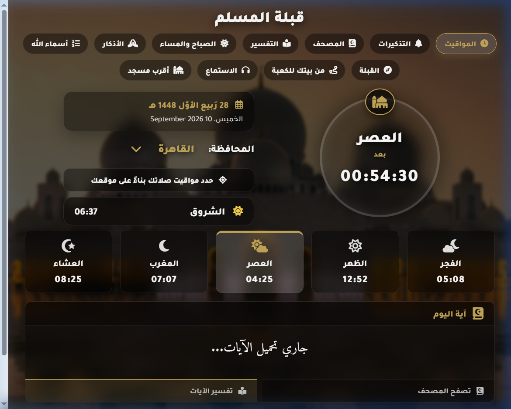
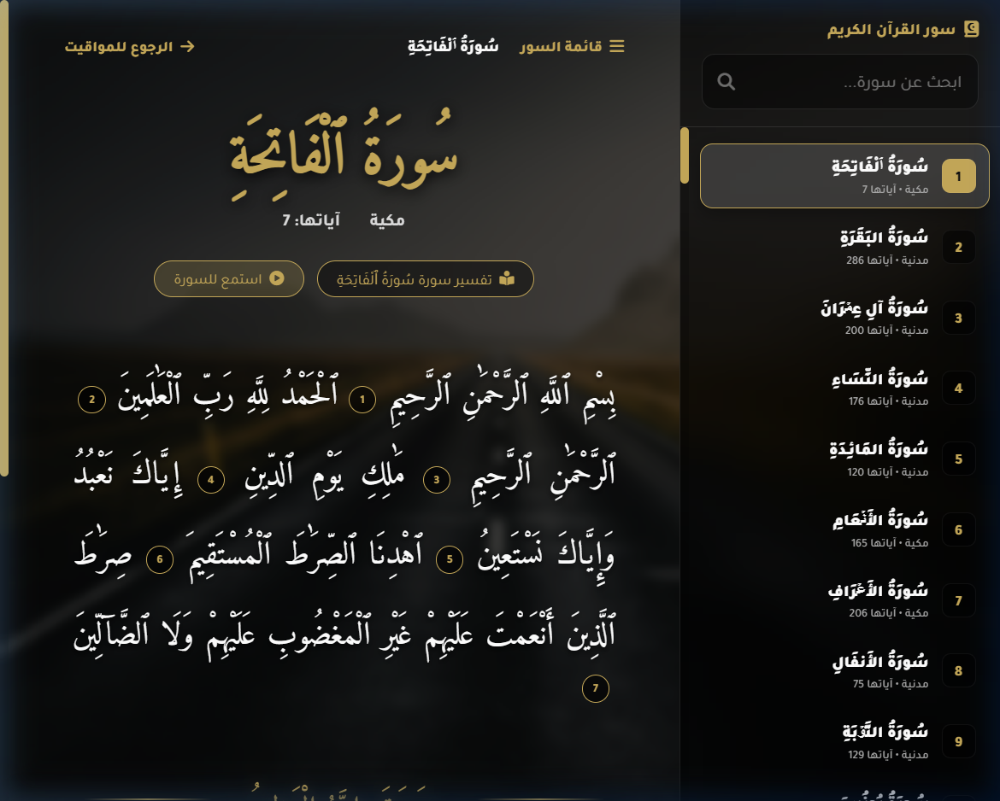
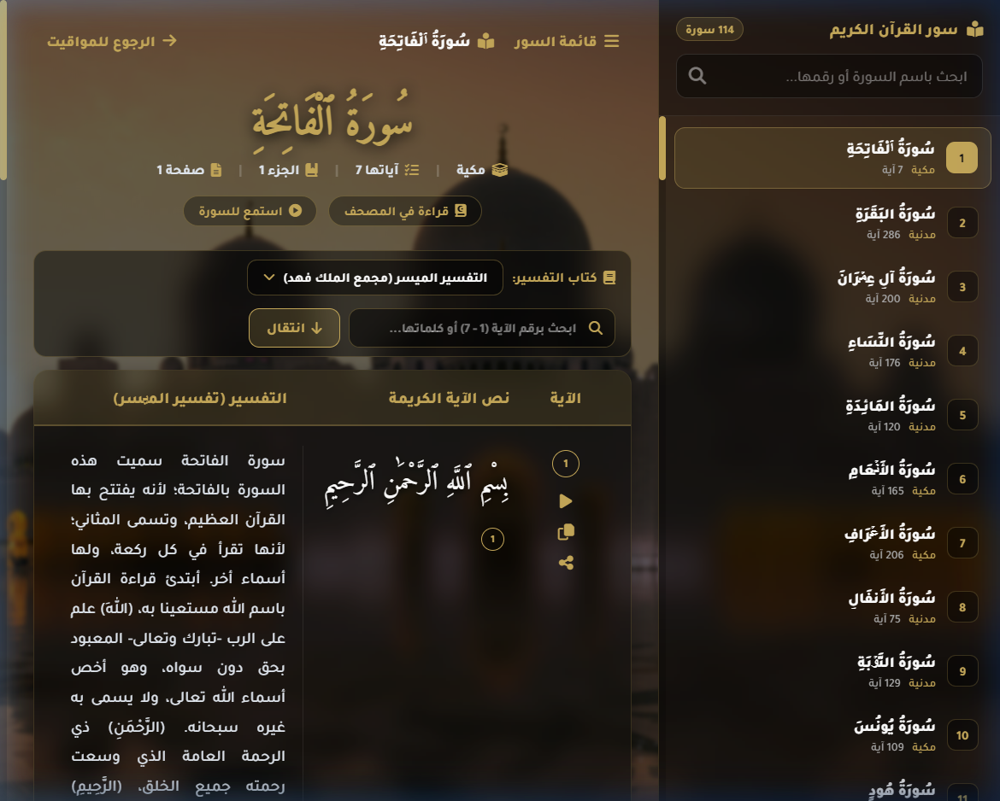
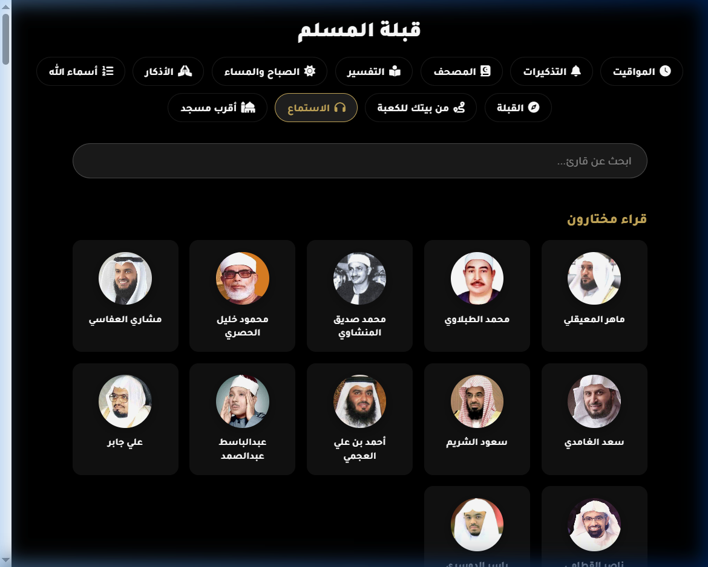
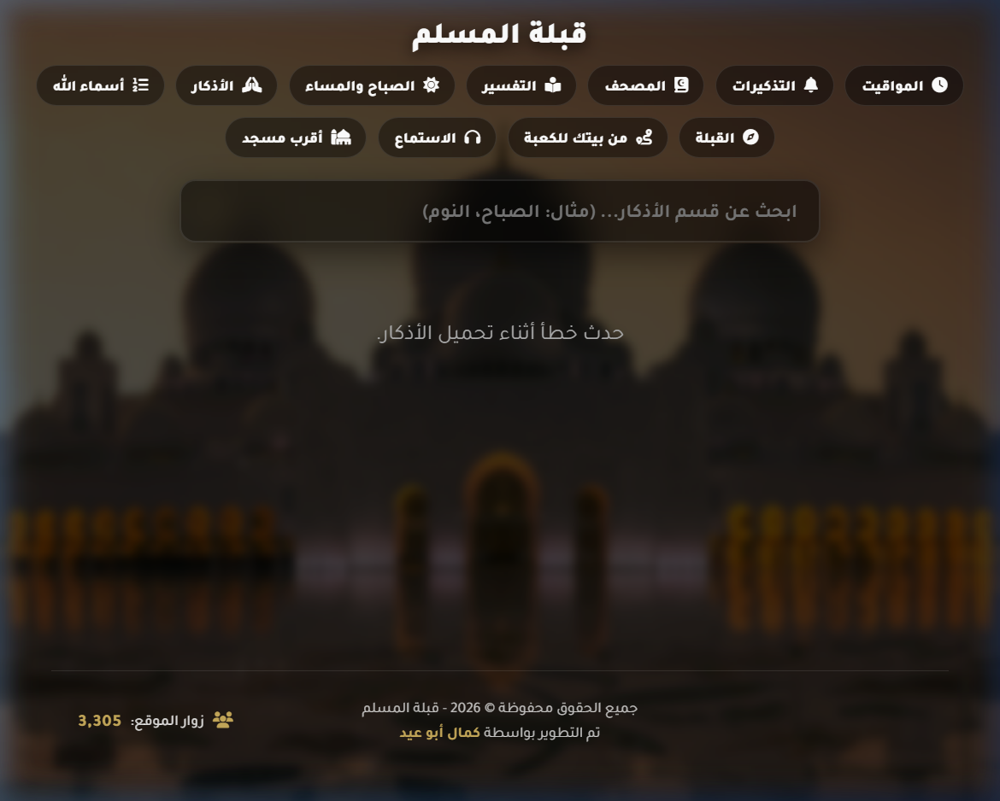
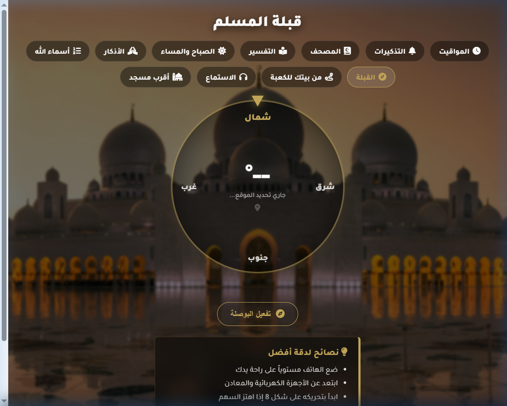
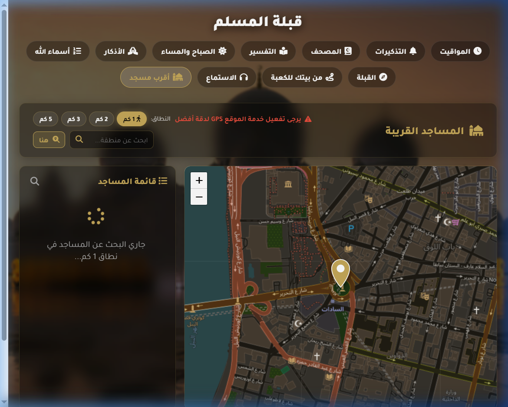
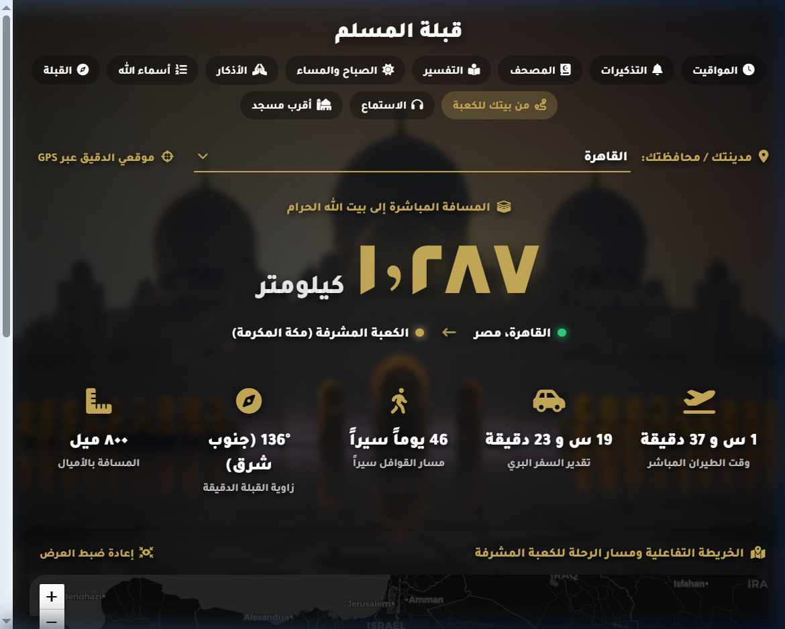
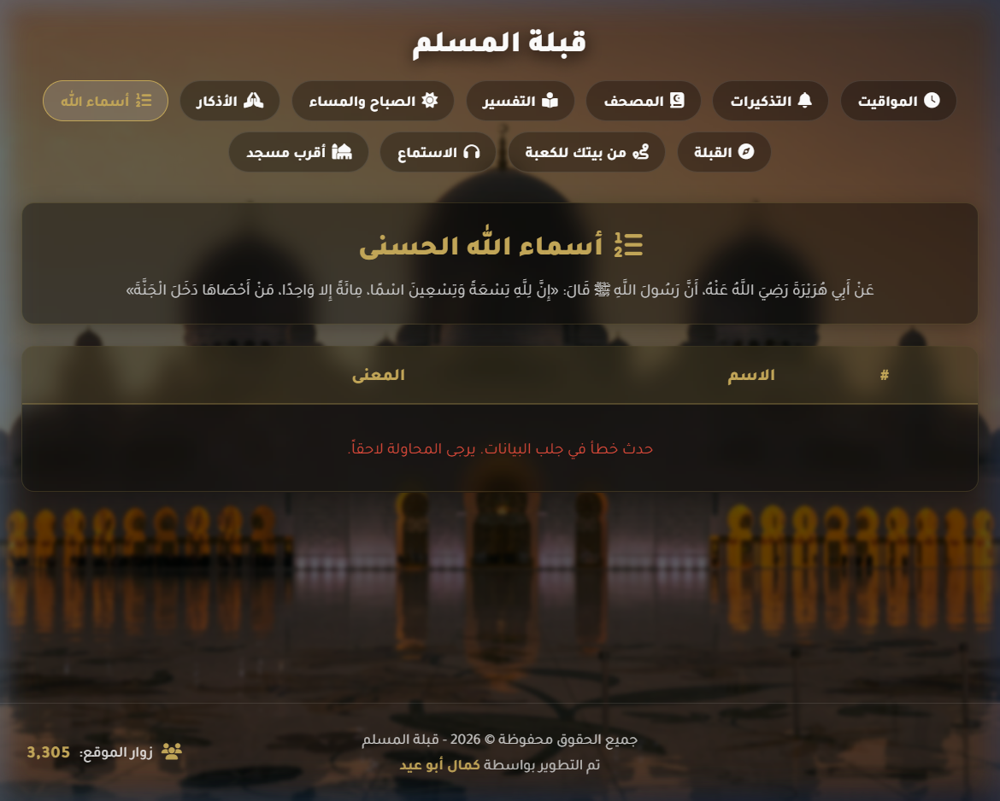
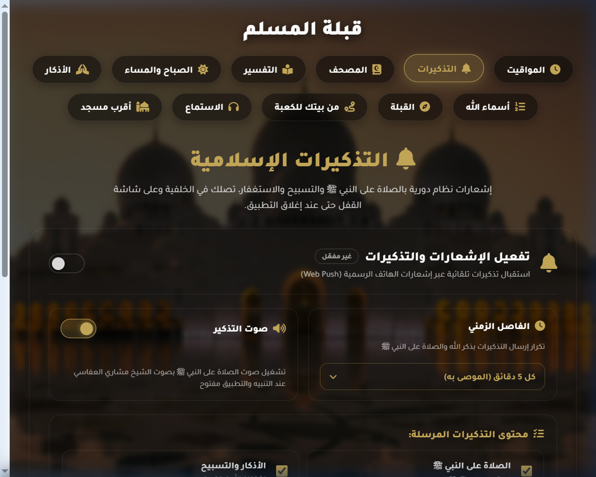

# Quiblah Muslim (Quiblah-Muslim-)

A modern, comprehensive Islamic Progressive Web Application (PWA) engineered to provide precise prayer timings, Holy Quran reading and tafseer, continuous audio recitation streaming, an accurate Qibla compass, interactive nearby mosque mapping, daily adhkar counters, and background Web Push notifications.

Built with Vanilla JavaScript, modular CSS, and semantic HTML5, designed for high performance and full offline availability.

---

## Table of Contents

- Overview
- Features and Screenshots
  - 1. Prayer Times and Dashboard
  - 2. Holy Quran Reader
  - 3. Quran Tafseer and Commentary
  - 4. Continuous Audio Player
  - 5. Daily Azkar and Electronic Tasbeeh
  - 6. Qibla Direction Compass
  - 7. Nearby Mosques Finder
  - 8. Geodesic Distance to Kaaba
  - 9. 99 Names of Allah (Asmaul Husna)
  - 10. Encrypted Web Push Reminders
- Project Architecture
- Code Organization and Language Breakdown
- Tech Stack and Dependencies
- Local Setup and Installation
- Progressive Web App (PWA) and Offline Support
- Contributing
- License and Author

---

## Overview

Quiblah Muslim is an open-source Islamic web application designed to serve as a reliable daily companion for Muslims worldwide. The application operates entirely client-side with minimal server dependencies, ensuring rapid load times, strong privacy, and robust offline performance across all desktop and mobile platforms.

---

## Features and Screenshots

### 1. Prayer Times and Dashboard



- **Description**: Displays precise daily prayer times (Fajr, Sunrise, Dhuhr, Asr, Maghrib, Isha) tailored to the user's geolocation, accompanied by a dynamic countdown timer indicating the time remaining until the next prayer.
- **How It Works**:
  - Automatically queries the browser Geolocation API (`navigator.geolocation`) to determine precise latitude and longitude coordinates.
  - Sends a lightweight request to the Aladhan API to calculate timings using standard international calculation conventions (e.g., Egyptian General Authority of Survey, Umm Al-Qura, ISNA).
  - Updates the active prayer status and remaining time every second through an asynchronous timer in `features/home/home.js`.
  - Integrates dual Gregorian and Hijri calendar dates.

---

### 2. Holy Quran Reader



- **Description**: A dedicated Quran reading interface featuring all 114 Surahs rendered in authentic Madani Arabic typography, complete with verse numbers, surah classification (Meccan/Medinan), ayah count, and instant ayah-level tafseer lookup.
- **How It Works**:
  - Preloaded locally via `core/quran_data.js` and `core/surahs_meta.js`, enabling instant, zero-latency rendering and 100% offline readability without network overhead.
  - Features an interactive sidebar drawer for fast surah navigation and text search.
  - Clicking any verse number opens a modal window providing instant simplified tafseer without leaving the reading flow.

---

### 3. Quran Tafseer and Commentary



- **Description**: An in-depth Quranic study module providing verse-by-verse commentary, translations, and explanations from authentic scholars (such as Al-Tafseer Al-Muyassar and Tafseer Al-Jalalayn).
- **How It Works**:
  - Allows dynamic switching between different tafseer editions via a custom dropdown.
  - Features dedicated ayah audio recitation playback directly inside each tafseer card.
  - Includes action buttons to quickly copy or share verse text and its explanation.
  - Implements an optimized infinite-scroll batching algorithm (`features/tafseer/tafseer.js`) to render long surahs smoothly.

---

### 4. Continuous Audio Player



- **Description**: A floating audio player inspired by modern streaming services that continues playing Quranic recitations uninterrupted while navigating between different pages of the application.
- **How It Works**:
  - Integrates with the MP3Quran API v3 to retrieve high-fidelity audio streams for numerous recognized reciters (e.g., Mishary Rashid Alafasy, Abdul Basit Abdul Samad, Mahmoud Khalil Al-Husary).
  - Uses `core/player-bridge.js` via `postMessage` communication with the parent window frame in `index.html`.
  - Supports track scrubbing, seeking, volume adjustment, previous/next surah switching, and an expandable mobile full-screen player view.

---

### 5. Daily Azkar and Electronic Tasbeeh



- **Description**: A comprehensive collection of daily Islamic supplications, including Morning and Evening Adhkar, post-prayer adhkar, waking/sleeping prayers, and Quranic duas with interactive repetition counters.
- **How It Works**:
  - Stored in local structured JSON files (`data/azkar.json` and `data/short_azkar.json`).
  - Interactive counter buttons track completed repetitions for each zikr.
  - Triggers haptic vibration feedback via `navigator.vibrate` and toast notifications when a target count is reached.
  - Remembers user progress locally so counters persist across sessions.

---

### 6. Qibla Direction Compass



- **Description**: A real-time digital compass that accurately calculates and visualizes the geographic bearing toward the Holy Kaaba in Mecca from any location on Earth.
- **How It Works**:
  - Utilizes device magnetometer hardware sensors via the W3C `DeviceOrientationEvent` (`webkitCompassHeading` for iOS Safari and absolute orientation angles for Android Chrome).
  - Calculates the forward azimuth to the Kaaba coordinates (21.4225° N, 39.8262° E) using spherical trigonometric great-circle formulas.
  - Renders a responsive, hardware-accelerated CSS needle that smoothly rotates to align with the true Qibla direction.

---

### 7. Nearby Mosques Finder



- **Description**: An interactive geospatial map discovering nearby mosques within adjustable search radiuses (1 km, 2 km, 3 km, and 5 km) from the user's current position.
- **How It Works**:
  - Built with Leaflet.js and OpenStreetMap cartographic data.
  - Queries the OpenStreetMap Overpass API (`overpass-api.de`) for places of worship tagged with `amenity=place_of_worship` and `religion=muslim` within the specified bounding radius.
  - Displays mosque locations as custom markers, provides straight-line distance calculations, and draws direct guide paths to the selected mosque.

---

### 8. Geodesic Distance to Kaaba



- **Description**: An interactive geographical visualization showing the exact distance in kilometers between the user's physical location and the Holy Kaaba in Mecca.
- **How It Works**:
  - Applies the mathematical Haversine formula to compute great-circle distance over the Earth's spherical surface.
  - Draws an arc path on Leaflet linking the user's GPS position directly to Mecca.
  - Displays formatted distance measurements and location telemetry.

---

### 9. 99 Names of Allah (Asmaul Husna)



- **Description**: A complete catalog of the 99 Beautiful Names of Allah (Asmaul Husna) presented in a card grid, detailing the Arabic script, English meaning, and spiritual significance of each name.
- **How It Works**:
  - Rendered dynamically from `data/names.json`.
  - Features real-time client-side search filtering by name, number, or keyword.
  - Optimized CSS transitions provide responsive card expansion for reading descriptions.

---

### 10. Encrypted Web Push Reminders



- **Description**: An automated notification system that delivers scheduled Islamic reminders directly to the user's device operating system, even when the browser is closed or inactive.
- **How It Works**:
  - Complies with the W3C Push API and VAPID (Voluntary Application Server Identification) standard.
  - Client subscription keys are managed by `core/reminders.js` and securely transmitted to the backend server.
  - Handled in the background by `service-worker.js` with audio chime playback and action buttons.

---

## Project Architecture

The codebase adheres to a **Feature-Based Modular Architecture**. Each domain feature contains its own encapsulated JavaScript logic and CSS stylesheet:

```text
PrayerTimer/
├── core/                                # Core shared modules and libraries
│   ├── player-bridge.js                 # Cross-frame audio communication bridge
│   ├── pwa.js                           # Progressive Web App lifecycle manager
│   ├── reminders.js                     # Web Push subscription client
│   ├── toast.js                         # Global notification toast system
│   ├── visitor-counter.js               # Anonymous visitor analytics tracker
│   ├── surahs_meta.js                   # Quran chapter indices and metadata
│   └── quran_data.js                    # Complete Quran Arabic text dataset
│
├── features/                            # Isolated feature modules (Logic + Styles)
│   ├── landing/                         # Home landing shell (landing.js, landing.css)
│   ├── home/                            # Prayer times dashboard (home.js, home.css)
│   ├── quran/                           # Quran reading interface (quran.js, quran.css)
│   ├── tafseer/                         # Quran commentary module (tafseer.js, tafseer.css)
│   ├── listen/                          # Audio streaming player (listen.js, listen.css)
│   ├── azkar/                           # Daily adhkar catalog (azkar.js, azkar.css)
│   ├── sabah-masaa/                     # Morning/evening azkar (sabah-masaa.js, sabah-masaa.css)
│   ├── names/                           # 99 Names of Allah (names.js, names.css)
│   ├── qibla/                           # Qibla compass module (qibla.js, qibla.css)
│   ├── mosques/                         # Nearby mosque finder (mosques.js, mosques.css)
│   ├── distance/                        # Kaaba distance calculator (distance.js, distance.css)
│   └── reminders/                       # Notification settings (reminders-page.js, reminders-page.css)
│
├── data/                                # Static datasets (JSON)
│   ├── azkar.json                       # Comprehensive supplications
│   ├── short_azkar.json                 # Quick prayer adhkar
│   ├── names.json                       # Asmaul Husna definitions
│   └── verses.json                      # Selected Quranic verses
│
├── assets/                              # Static visual and audio assets
│   ├── screenshots/                     # Feature documentation screenshots
│   ├── Azan/                            # Audio recordings for prayer calls
│   ├── bg1.jpg, bg2.jpg, bg3.jpg        # Background photography
│   └── mosque.svg, favicon.png          # Vector branding assets
│
├── icons/                               # PWA icons for various screen resolutions
├── api/                                 # Vercel serverless push notification handlers
├── *.html                               # Semantic HTML entrypoints
├── service-worker.js                    # PWA Service Worker with offline caching (v9)
├── server.js                            # Local Node.js HTTP and Push server
├── .gitattributes                       # GitHub Linguist language detection overrides
└── README.md                            # Project documentation
```

---

## Code Organization and Language Breakdown

All inline scripts and embedded styles have been extracted into independent, modular files. As a result, **JavaScript represents over 91% of the entire codebase**:

| Language | Number of Files | Lines of Code | Size (Bytes) | Percentage of Code |
|---|:---:|:---:|:---:|:---:|
| JavaScript (`.js`) | 33 files | 9,956 lines | 3,533,999 B | 91.4% |
| CSS (`.css`) | 12 files | 6,760 lines | 215,077 B | 5.6% |
| HTML (`.html`) | 12 files | 1,988 lines | 116,476 B | 3.0% |

Configured via `.gitattributes` to ensure GitHub Linguist accurately reflects the codebase without noise from data or dependencies.

---

## Tech Stack and Dependencies

- **Core Scripting**: Vanilla JavaScript (Modern ECMAScript ES6+).
- **Styling Architecture**: Native CSS3 with CSS Custom Properties (Variables), Flexbox, and CSS Grid.
- **PWA Capabilities**: Service Worker API, Cache Storage API, Web App Manifest.
- **Hardware Integration**: DeviceOrientation API, Geolocation API, Vibration API.
- **Mapping and GIS**: Leaflet.js (v1.9.4), OpenStreetMap, Overpass API.
- **Network Requests**: Axios HTTP client.
- **Backend / Notifications**: Node.js HTTP runtime, `web-push` library with VAPID key encryption.
- **Typography and Icons**: FontAwesome 6, Google Fonts (Tajawal, Amiri Quran).

---

## Local Setup and Installation

The application requires no complex build pipelines or compilers. You can run it locally with Node.js or any standard HTTP web server:

### Prerequisites

- Node.js (version 16 or higher recommended).
- Git installed on your system.

### Steps

1. Clone the repository:
   ```bash
   git clone https://github.com/KamalAboueidd/Quiblah-Muslim-.git
   cd Quiblah-Muslim-
   ```

2. Install backend dependencies (optional, needed for Web Push reminders):
   ```bash
   npm install
   ```

3. Start the local server:
   ```bash
   npm start
   # or
   node server.js
   ```

4. Open your web browser and navigate to:
   ```text
   http://localhost:8000
   ```

Note: Hardware sensor access (such as compass orientation and exact GPS geolocation) requires HTTPS in production environments according to browser security standards. When deployed to GitHub Pages or Vercel, HTTPS is enabled automatically.

---

## Progressive Web App (PWA) and Offline Support

Quiblah Muslim is an installable Progressive Web Application:

- **Installation**: Can be installed directly to the home screen or desktop on iOS, Android, macOS, and Windows via Chrome, Edge, or Safari.
- **Offline First**: The custom `service-worker.js` (Cache v9) pre-caches all critical application shell assets, modules, stylesheets, and datasets during installation.
- **Resilient Fallback**: If network connectivity drops, all core features (Quran reading, daily adhkar, Asmaul Husna, and saved prayer timings) remain fully accessible.

---

## Contributing

Contributions from the open-source community are welcome:

1. Fork the repository on GitHub.
2. Create a feature branch:
   ```bash
   git checkout -b feature/your-feature-name
   ```
3. Maintain the modular architecture by placing JavaScript and CSS in their respective `features/<feature-name>/` directory.
4. Commit your changes with clear, descriptive commit messages:
   ```bash
   git commit -m "feat: add your feature description"
   ```
5. Push your branch to your fork:
   ```bash
   git push origin feature/your-feature-name
   ```
6. Open a Pull Request on GitHub.

---

## License and Author

- **Author**: Kamal Abou Eid
- **Repository**: [https://github.com/KamalAboueidd/Quiblah-Muslim-](https://github.com/KamalAboueidd/Quiblah-Muslim-)
- **License**: This project is open-source under the ISC License. Free for use, study, and contribution.